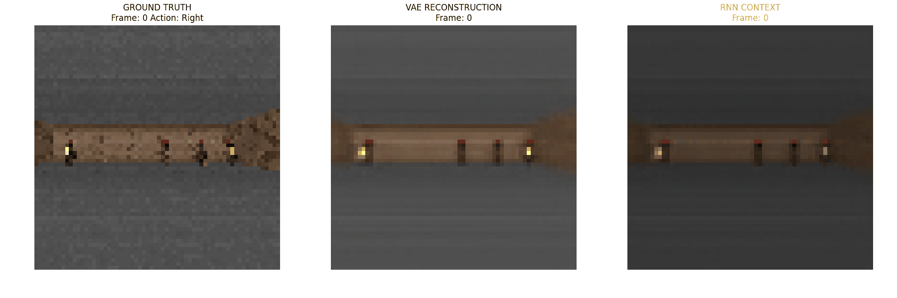
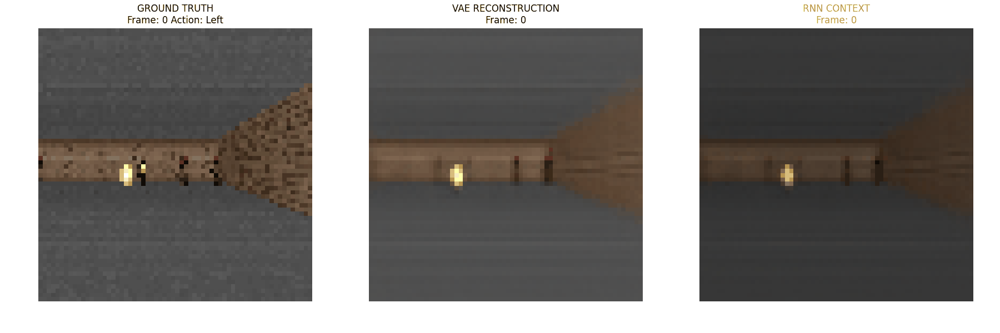
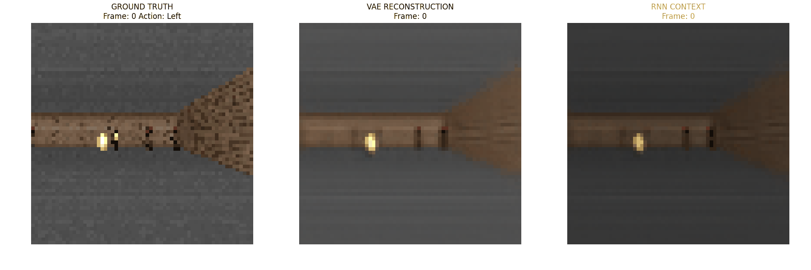
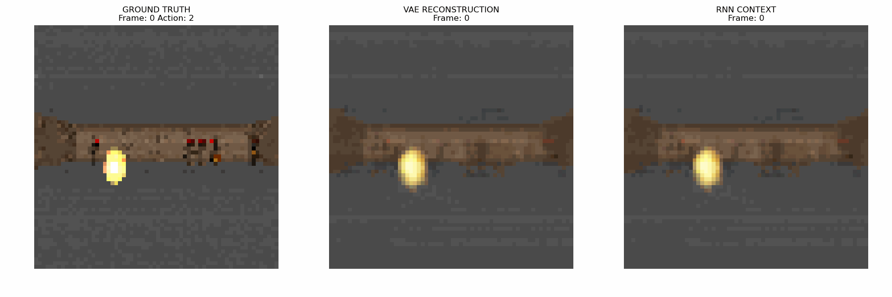

# World Models

Learning to dream in Doom. A PyTorch implementation of *World Models* (Ha & Schmidhuber, 2018), using ViZDoom's Take Cover environment.

The model watches recorded gameplay, learns to compress frames and predict what comes next, then becomes an environment of its own. A small controller can train inside that learned world.



Left to right: **real gameplay → VAE reconstruction → RNN dream**. After the initial context, the dream feeds its own predictions back in, following the recorded actions without seeing any more real frames. Watch where it starts to drift.

## A little more memory

One frame tells you where a fireball is. A few frames can tell you where it's going. These clips compare giving the RNN one or five real frames before letting it predict the rest.

**1 context frame**



**5 context frames**



<details>
<summary>An earlier experiment with a 32-dimensional latent space</summary>



</details>

## Under the hood

- **VAE**: compresses each 64 × 64 RGB frame into a latent vector, and decodes it back into an image.
- **MDN-RNN**: takes the latent vector and an action, then predicts a mixture of possible next states and the probability of the episode ending. Sampling from that mixture produces the dream.
- **Controller**: a linear layer that chooses an action from the latent vector and the RNN's hidden and cell states. Trained with CMA-ES inside the dream, with evaluation in the real environment.

The clips above show reconstruction and prediction, rather than controller performance.

## Try the dream

Two interactive demos, run from the repo root:

```bash
python3 demo/dream.py           # move around inside the learned world
python3 demo/grounded_dream.py  # real environment and dream side by side
```

These need trained VAE and RNN checkpoints; weights and rollout datasets aren't included. Set `VAE_PATH`, `RNN_PATH`, and the matching model settings near the top of each script. The demos use PyTorch, NumPy, Gymnasium, ViZDoom, and OpenCV; the comparison demo also imports `cma` through the controller module. A desktop display is needed for the OpenCV windows.

Use **A / D** to move and **Q / Esc** to quit. In the comparison demo, **G** brings the dream back to the current real frame. **C** toggles the controller when a controller checkpoint is loaded; set `USE_CONTROLLER = False` to start with manual control.

## Explore the code

The training path is: collect gameplay → train the VAE → encode the rollouts → train the RNN → train the controller in the dream.

| Where | What's there |
| --- | --- |
| [data/](data/) | Random-action rollout collection, datasets, and inspection tools |
| [train/](train/) | VAE and RNN training, latent preprocessing, and CMA-ES controller training |
| [modules/](modules/) | The models, dream environment, and comparison animation code |
| [notebooks/wm_eval.ipynb](notebooks/wm_eval.ipynb) | Reconstruction and dream rollout comparisons |
| [notebooks/vae_latent_experiments.ipynb](notebooks/vae_latent_experiments.ipynb) | Experiments with the VAE's latent space |

